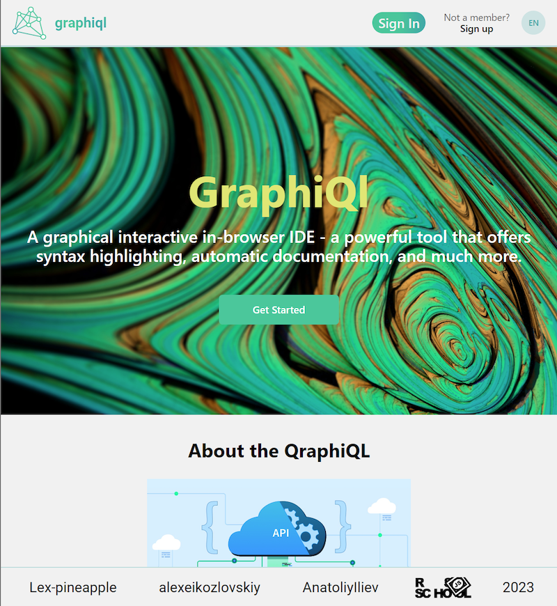

# GraphiQL Playground

GraphiQL is the playground/IDE for graphQL requests. This project is made for graphQL requests to the Rick and Morty API.

## Deployment

[GraphiQL Playground](https://merrybeavers-graphiql.netlify.app/)

## Technical stack:

- React
- React Router
- React Intl
- React-codemirror
- Typescript
- Vite
- Firebase
- Monaco-graphQL
- Eslint

## Key features:

- Execute GraphQL queries 
- Request variables
- Custom request headers
- Two languages
- Sign-in with a google account
- Custom 404 page
- Redirect when token expired
- Decorative query and response